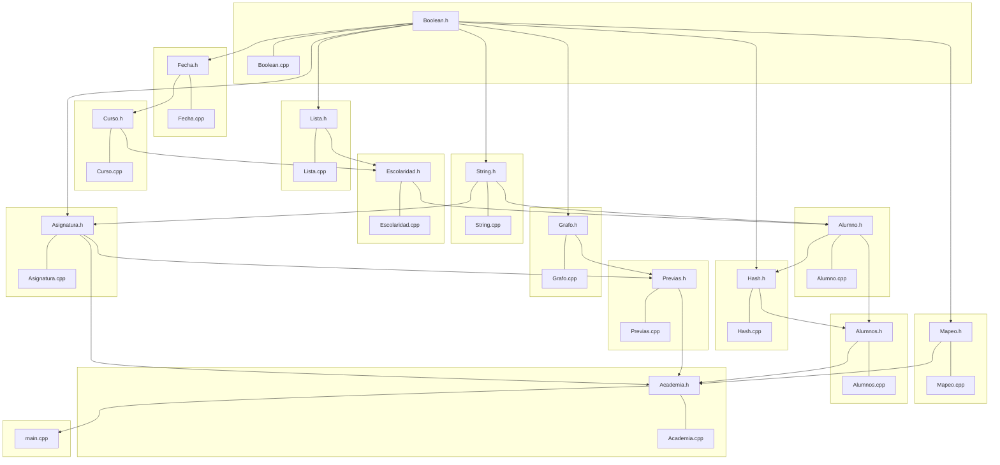

```mermaid
flowchart TD

subgraph Boolean[" "]
    direction LR
    BooleanH["Boolean.h"] --- BooleanCPP["Boolean.cpp"]
end

subgraph String[" "]
    direction LR
    StringH["String.h"] --- StringCPP["String.cpp"]
end

subgraph Fecha[" "]
    direction LR
    FechaH["Fecha.h"] --- FechaCPP["Fecha.cpp"]
end

subgraph Lista[" "]
    direction LR
    ListaH["Lista.h"] --- ListaCPP["Lista.cpp"]
end

subgraph Hash[" "]
    direction LR
    HashH["Hash.h"] --- HashCPP["Hash.cpp"]
end

subgraph Mapeo[" "]
    direction LR
    MapeoH["Mapeo.h"] --- MapeoCPP["Mapeo.cpp"]
end

subgraph Grafo[" "]
    direction LR
    GrafoH["Grafo.h"] --- GrafoCPP["Grafo.cpp"]
end

subgraph Asignatura[" "]
    direction LR
    AsignaturaH["Asignatura.h"] --- AsignaturaCPP["Asignatura.cpp"]
end

subgraph Curso[" "]
    direction LR
    CursoH["Curso.h"] --- CursoCPP["Curso.cpp"]
end

subgraph Escolaridad[" "]
    direction LR
    EscolaridadH["Escolaridad.h"] --- EscolaridadCPP["Escolaridad.cpp"]
end

subgraph Alumno[" "]
    direction LR
    AlumnoH["Alumno.h"] --- AlumnoCPP["Alumno.cpp"]
end

subgraph Alumnos[" "]
    direction LR
    AlumnosH["Alumnos.h"] --- AlumnosCPP["Alumnos.cpp"]
end

subgraph Previas[" "]
    direction LR
    PreviasH["Previas.h"] --- PreviasCPP["Previas.cpp"]
end

subgraph Academia[" "]
    direction LR
    AcademiaH["Academia.h"] --- AcademiaCPP["Academia.cpp"]
end

subgraph Main[" "]
    direction LR
    MainCPP["main.cpp"]
end

BooleanH --> StringH
BooleanH --> FechaH
BooleanH --> ListaH
BooleanH --> HashH
BooleanH --> MapeoH
BooleanH --> GrafoH

StringH --> AsignaturaH
BooleanH --> AsignaturaH

FechaH --> CursoH

ListaH --> EscolaridadH
CursoH --> EscolaridadH

StringH --> AlumnoH
EscolaridadH --> AlumnoH

AlumnoH --> HashH
HashH --> AlumnosH
AlumnoH --> AlumnosH

GrafoH --> PreviasH
AsignaturaH --> PreviasH

MapeoH --> AcademiaH
AlumnosH --> AcademiaH
PreviasH --> AcademiaH
AsignaturaH --> AcademiaH

AcademiaH --> MainCPP
```